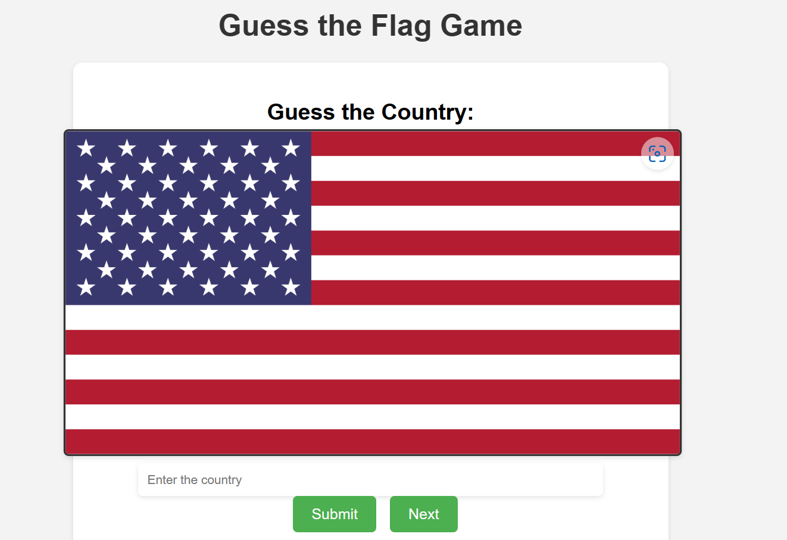

# Guess the Flag Game

A multiplayer game where players take turns guessing the country based on its flag.

## How to Play

1. Open the game in a web browser.
2. The game will display a flag image.
3. Player 1 enters the name of the country they think the flag belongs to in the input field.
4. Player 1 clicks the **Submit** button to check their guess.
5. If Player 1's guess is correct, they will receive a congratulatory message.
6. If Player 1's guess is incorrect, they will be informed of the correct country.
7. Player 1 clicks the **Next** button to proceed to the next flag.
8. Player 2 then takes their turn by following steps 3-7.
9. The game continues with players taking turns guessing flags.
10. Enjoy playing and challenge each other to see who can guess the most flags correctly!

## Features

- Simple and intuitive gameplay for multiplayer fun.
- Flags from various countries to guess.
- Colorful and responsive design.
- Smooth transitions and hover effects for a visually appealing experience.
- Easy-to-understand instructions and feedback messages.
- The game can be easily customized by adding or modifying the flag list.

## Why it's Better

- Provides an entertaining multiplayer experience, allowing players to compete and challenge each other.
- Enhances geographical awareness and recognition of different countries.
- Offers a convenient and accessible web-based platform for multiplayer gaming.
- The colorful and visually appealing design adds to the overall enjoyment of the game.
- The responsiveness ensures a seamless experience on both desktop and mobile devices.
- The game can be customized and expanded to include more flags or additional features.

## Preview

