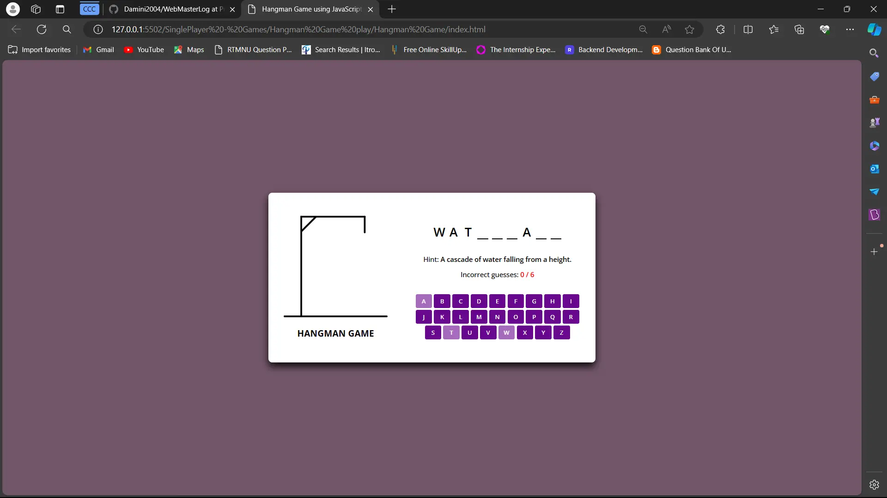

# guess-the-number-game
In this Hangman Game  will guess the answer of given riddle in order to choose correct option and this game 6 chances to guess the letter
## Instructions
### Game Objective:

- The computer will provide riddle and give 6 chance to guess the letter that present in answer.
- Your goal is to guess this answer letter within 6 attempts.
### How to Play:

- The game will prompt you to enter your guess.
- After each guess, if letter correct then it will show on the frontend page and if it is not correct then the image will added with hangman image .
### Game Rules:

- You have 6 attempts to guess the correct letter.
- The game will provide feedback after each letter to guide you towards the correct answer.
- If you guess the number within 6 attempts, you win. Otherwise, you lose the game.
### Screenshots:
  