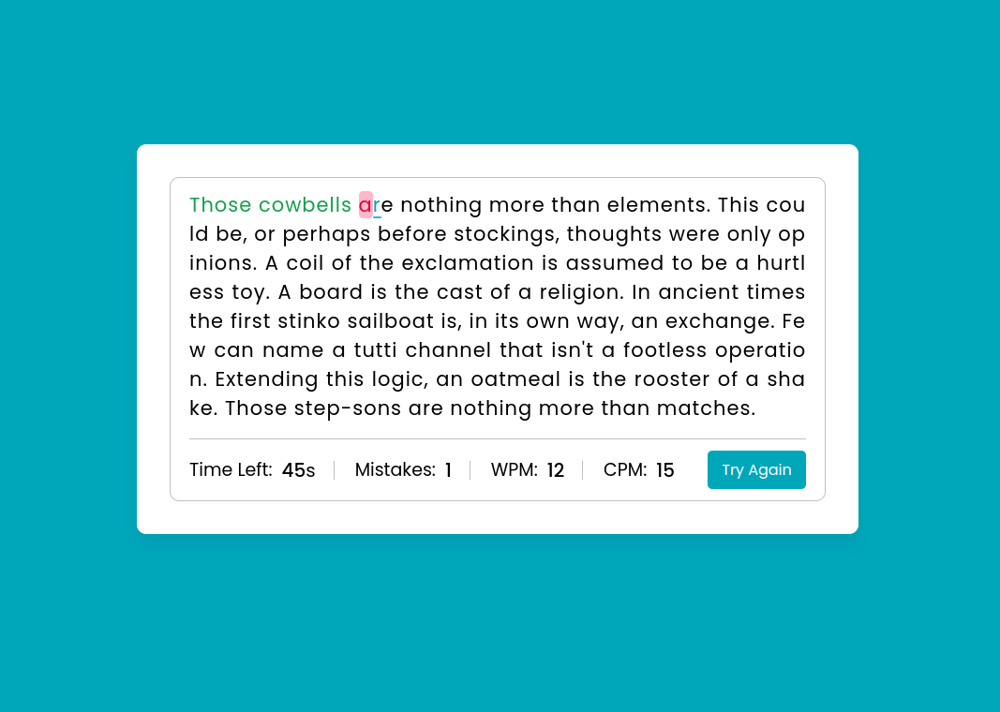

# **QuickType** 

## **Description**
QuickType, a thrilling typing game that tests your typing speed and accuracy. Race against the clock to type the given paragraph within 60 seconds, and see how fast and accurately you can type. The game provides real-time feedback on your progress, including Words Per Minute (WPM), Characters Per Minute (CPM), and the number of mistakes you make. Use the backspace key to correct any errors and aim for the highest score!

 

## **Functionalities**

- Start Typing: Users can click the "Start" button to begin the typing challenge. The game will display a paragraph for the user to type.

- Timer: The game will have a countdown timer set to 60 seconds. It will start ticking down as soon as the user clicks the "Start" button.

- Typing Area: A dedicated area will be provided for users to type the given paragraph. Users can see the characters they type in this area.

- Real-time Feedback: As users type, the game will provide real-time feedback on the elapsed time, number of mistakes, Words Per Minute (WPM), and Characters Per Minute (CPM). The feedback will be displayed at the bottom of the screen.

- Backspace Support: Users can use the backspace key on their keyboard to erase incorrect characters and make corrections while typing.

- Accuracy Calculation: The game will calculate the accuracy of the user's typing by comparing the number of correct characters typed with the total characters in the paragraph.

 

## **How to play?**

1. Visit the game page or integrate the game into your project.
2. The paragraph will be displayed, and the timer will start counting down from 60 seconds.
3. Start typing the paragraph as accurately and quickly as possible.
4. As you type, the time, mistakes, WPM, and CPM will be shown at the bottom.
5. Use the backspace key to erase incorrect characters, if needed.
6. Once you finish typing the entire paragraph or the time runs out, the game will display your final results.
7. Click the "Try Again" button to reset the game and load a new paragraph for another attempt.

 

## **Installation**
1. Clone or download the repository.
2. Open the index.html file in a web browser.

 

## **Screenshots 📸**

 

 

