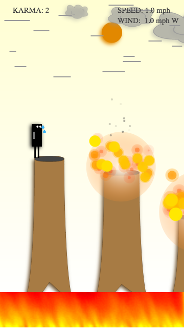
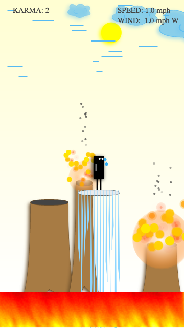
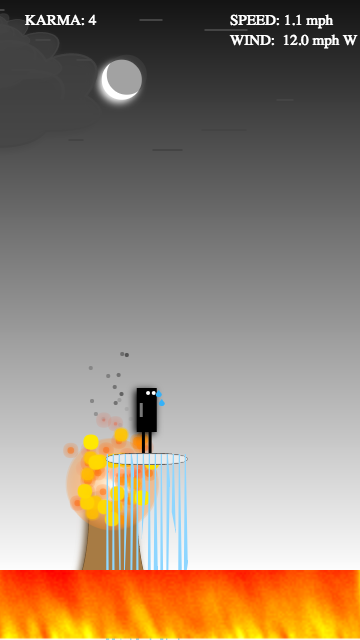
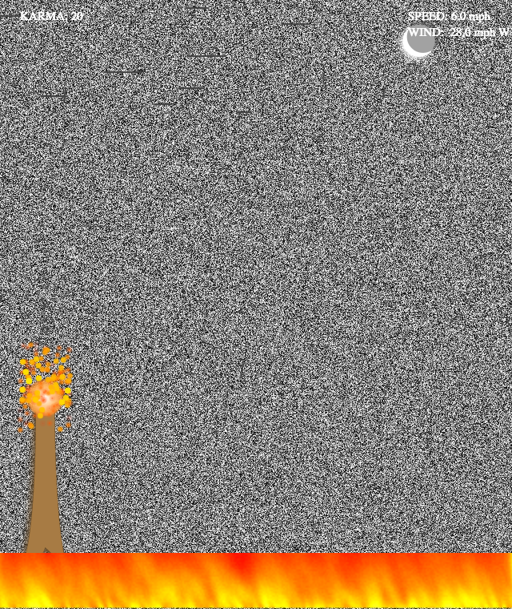
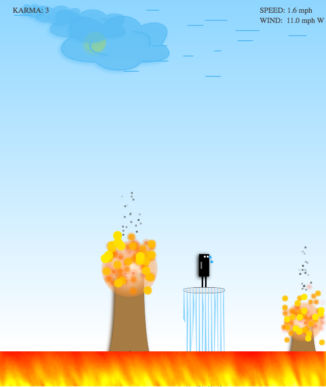
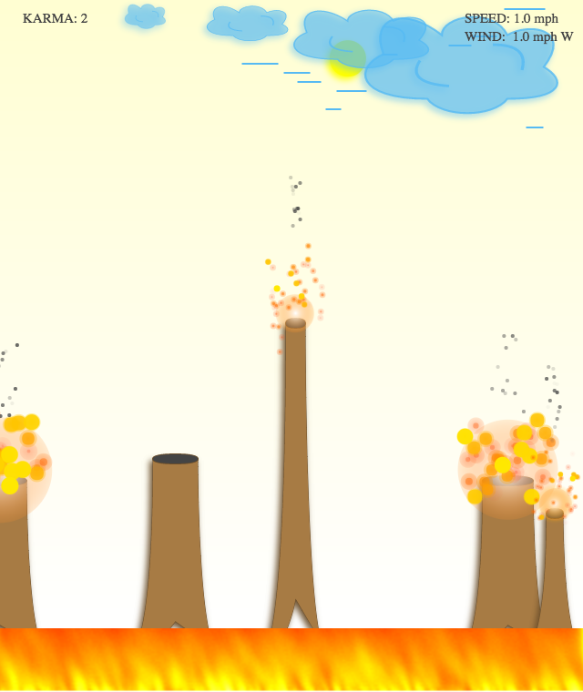
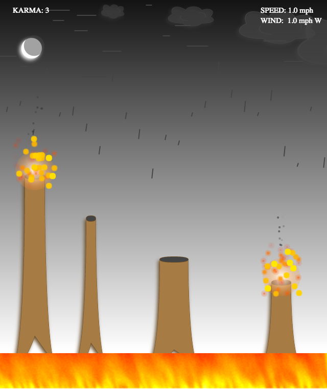

Save The Forest
===============

Entry game for [js13kGames](http://js13kgames.com/entries/2016) competition.

A fully canvas based HTML5 game where a player has to extinguish fire on tress using his magical water tank in order to save the Burning Forests.

Rules
-----

1. Press Space or tap to keep jumping the player.
2. Land on trees to save them and earn karma.
3. Don't let the glithces hinder the journey.

Screenshots
-----------

Theme - Glitch
--------------

* Climatic Abrupt changes
* Player struggles to jump off tree if tries to climb from corner
* Glitchy screen after speed of game is > 1.6 mph
